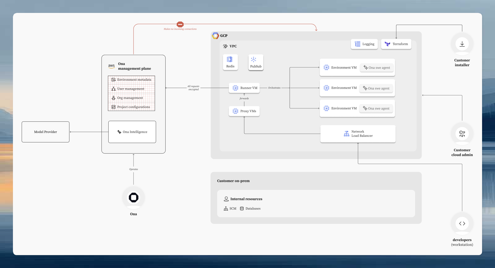

# Ona GCP Runner

This is the Terraform module for the Ona GCP Runner. It deploys an
[Ona](https://ona.com) runner in your Google Cloud VPC, where each development
environment runs as a Compute Engine instance inside your project — source code
and credentials never leave your infrastructure.

> GCP Runners require an [Enterprise plan](https://ona.com/pricing).
> To get access, [contact our sales](https://ona.com/contact/sales).

Refer to [the Ona documentation](https://ona.com/docs/ona/runners/gcp/overview)
for setup instructions, configuration options, and troubleshooting.

---

  

---

## Example

The [`runner-with-networking`](./examples/runner-with-networking/) example
provides a full infrastructure setup including VPC, DNS, and certificates.

## Releases

New stable releases are published roughly once a week. To get notified when a
release is available, subscribe to the Pub/Sub release notifications topic from
your own GCP project. See the
[Release Notifications](https://ona.com/docs/ona/runners/gcp/update-runner#release-notifications)
documentation for topic details, message format, and subscription examples.
