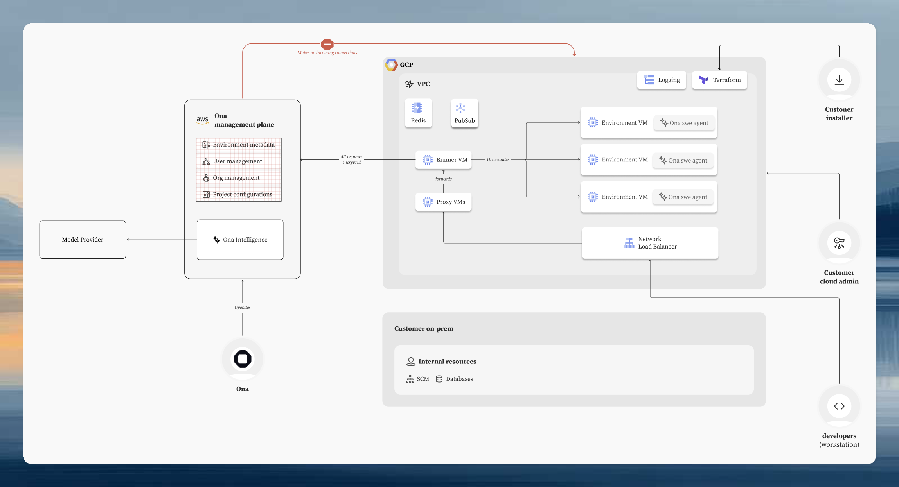

# Ona GCP Runner

This is the Terraform module for the Ona GCP Runner. It deploys an
[Ona](https://ona.com) runner in your Google Cloud VPC, where each development
environment runs as a Compute Engine instance inside your project — source code
and credentials never leave your infrastructure.

> GCP Runners require an [Enterprise plan](https://ona.com/pricing).
> To get access, [contact our sales](https://ona.com/contact/sales).

Refer to [the Ona documentation](https://ona.com/docs/ona/runners/gcp/overview)
for setup instructions, configuration options, and troubleshooting.

---

  

---

## Example

The [`runner-with-networking`](./examples/runner-with-networking/) example
provides a full infrastructure setup including VPC, DNS, and certificates.

## Runner secrets key lifecycle

Terraform creates the Secret Manager secret and its IAM policy, but it does not
manage a secret version for the runner secrets key. The runner writes the first
version, verifies that Secret Manager returns the same key, and then removes the
legacy copy from Redis. This keeps the key material out of Terraform state.

Subsequent Terraform applies leave runner-created versions unchanged. A
`terraform destroy` removes the secret and its versions with the rest of the
runner infrastructure.

## Docker registry credentials

When `custom_images.docker_config_json` is set, the module stores the Docker
configuration in a dedicated GCS bucket. Only the runner and proxy service
accounts receive `roles/storage.objectViewer` on that bucket. Environment VMs
continue to read required non-secret bootstrap content from the separate runner
assets bucket and receive no module-managed access to the credential bucket.

On the first apply after upgrading from a version that stored
`docker-config.json` in the runner assets bucket, Terraform creates the private
bucket and its reader bindings, updates runner and proxy instance templates,
and removes only the old `docker-config.json` object from the runner assets
bucket. Other runner assets are unchanged. Review the plan to confirm both the
new object creation and the old object replacement before applying.

Pre-created service accounts use the same resource-specific bucket bindings,
including when `pre_created_service_accounts.attach_iam_policies` is `false`.
The Terraform deployer therefore still needs permission to manage IAM on the
module-created bucket. IAM administrators must also remove any project-,
folder-, or organization-level Storage roles (including grants inherited
through groups) that let the environment VM service account read arbitrary
buckets. Such inherited grants defeat this bucket-level separation. Do not
grant the environment VM service account access to the Docker credential
bucket; externally managed runner and proxy identities need only
`roles/storage.objectViewer` on that bucket.

This separation does not remove Docker credentials from Terraform state and
does not change Artifact Registry, KMS, or VM metadata permissions.

## Releases

New stable releases are published roughly once a week. To get notified when a
release is available, subscribe to the Pub/Sub release notifications topic from
your own GCP project. See the
[Release Notifications](https://ona.com/docs/ona/runners/gcp/update-runner#release-notifications)
documentation for topic details, message format, and subscription examples.
